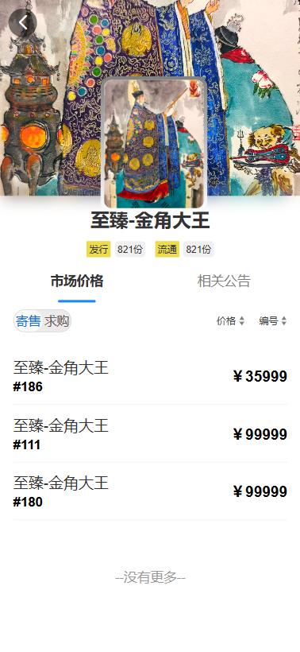
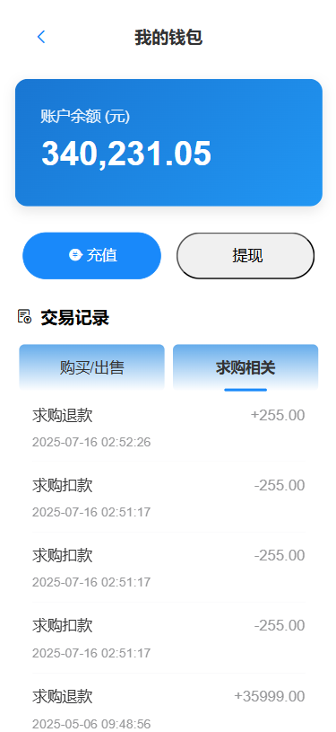

# IBox交易平台

一个基于Vue3前端和Spring Boot后端的藏品交易平台。
## 1.项目介绍
### 1.1功能特性
- 用户注册与认证登录
- 藏品上架与展示
- 交易市场浏览
- 购买与出售功能
- 求购功能
- 公告功能
- 个人藏品展示
- 我的订单管理
- 我的钱包管理
- 个人设置管理

### 1.2 技术栈

####  1.2.1前端技术栈
##### 1.2.1.1  **核心框架**  

##### 1.2.1.1  **UI组件库**  

##### 1.2.1.1  **HTTP客户端**  

####  1.2.2后端技术栈
##### 1.2.1.1  **核心框架**  

##### 1.2.1.1  **安全认证**  

##### 1.2.1.1  **数据库**  

##### 1.2.1.1  **中间件**  

##### 1.2.1.1  **工具**  

### 1.3 开发工具
**前端开发工具**
   Visual Studio Code
   
 **后端开发工具**
   IntelliJ IDEA

## 2.快速开始

### 2.1前置要求

- Node.js (版本16.13.2)
- Java JDK (版本1.8)
- MySQL (版本5.6.10)
- Redis(版本5.0.14)

### 2.2安装与运行

#### 2.2.1**后端服务**

1. 创建数据库并配置`application.yml`
	配置本地**datasource**
	**redis**默认密码为空
	配置**file:  upload-dir**上传路径为本机文件夹
2. 启动后端服务：IBoxBackEndApplication
#### 2.2.1**前端服务**
1. 安装依赖 
	**npm install**
2. 启动开发服务器 
	**npm run dev**

## 3.效果展示
	

  
  
  

 
 
 

  
  
  	

 
 
 

  
  
  

 
 
 

  
  
  

 
 
 

  
  
  

## 4.

